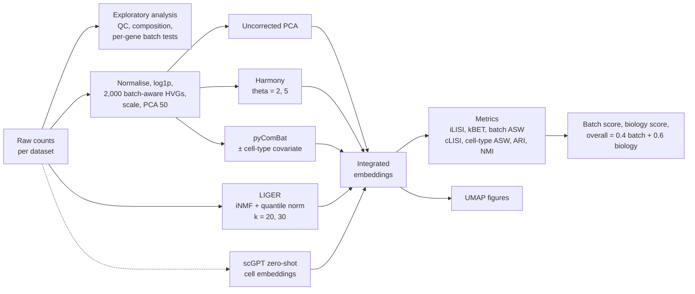
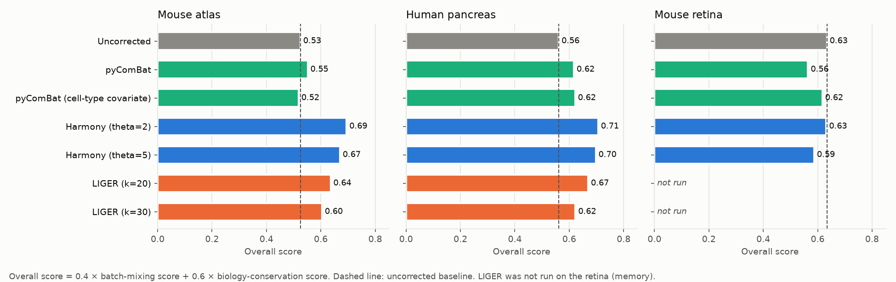
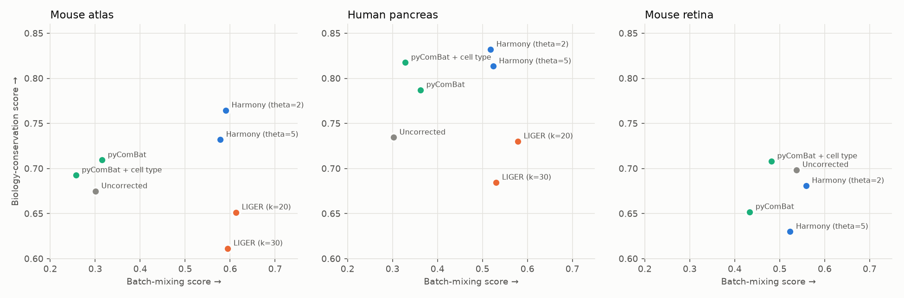
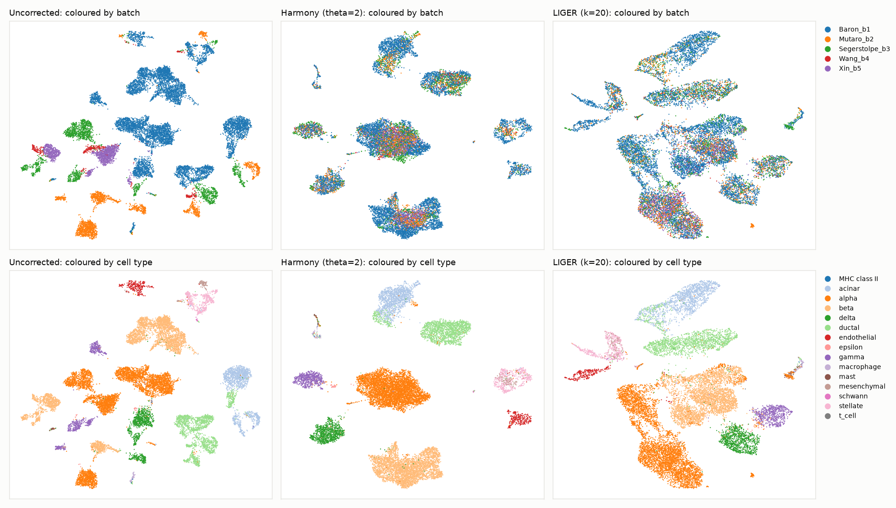

---

# Batch Effect Correction Benchmarking for scRNA-seq Data

This repository contains the code for evaluating batch correction methods as part of my Master's Thesis: **Batch Effect Correction: A Comparative Analysis of Algorithms and LLM Utilities**. The project investigates various batch correction methods for single-cell RNA sequencing (scRNA-seq) data, providing comparative analyses and insights into their performance across datasets.

## Data Source
The data used in this project is sourced from the [JinmiaoChenLab Batch Effect Removal Benchmarking repository](https://hub.docker.com/r/jinmiaochenlab/batch-effect-removal-benchmarking) (Tran et al., *Genome Biology* 2020). The datasets include:

| Dataset | Folder in the image | Cells | Batches | Cell types | Source of the batch effect |
|---|---|---|---|---|---|
| Mouse Atlas | `dataset2` | 6,954 | 2 | 11 | different technologies (Microwell-seq vs 10x) |
| Human Pancreas | `dataset4` | 14,767 | 5 | 15 | different technologies and labs (Baron, Muraro, Segerstolpe, Wang, Xin) |
| Mouse Retina | `dataset7` | 71,638 | 2 | 12 | same technology (Drop-seq), different laboratories |

`download_data.py` fetches the three datasets straight from Docker Hub. It streams the image layer and keeps only the needed folders, so Docker is not required.

## Workflow



Every method is scored on its own integrated embedding with the same code: PCA for the uncorrected data and ComBat, the Harmony-corrected PCA, LIGER's normalised H matrix and the scGPT cell embedding.

## Project Structure

```
batch_eval/                 shared code used by every script
  data.py                   dataset loaders (raw counts -> AnnData, cached as .h5ad)
  eda.py                    exploratory plots and batch-effect quantification
  methods.py                preprocessing, pyComBat, Harmony, LIGER
  metrics.py                LISI, kBET, ASW, ARI/NMI, same-batch neighbour fraction
  lisi.py                   LISI implementation (Korsunsky et al.; Slowikowski port)
  pipeline.py               runs EDA + all methods + metrics + figures for one dataset
mouse_atlas_batch_correction_eval.py
mouse_retina_batch_correction_eval.py
human_pancreas_batch_correction_eval.py
zero_shot_scgpt.py          scGPT zero-shot embedding of the pancreas data
summarize_results.py        builds the summary figures in docs/figures/
download_data.py
requirements.txt
```

## Usage

```bash
python -m venv .venv && source .venv/bin/activate
pip install -r requirements.txt

python download_data.py --out data          # ~3.8 GB streamed, ~2.7 GB kept
python mouse_atlas_batch_correction_eval.py
python human_pancreas_batch_correction_eval.py
python mouse_retina_batch_correction_eval.py # largest; pyliger needed ~10 GB RAM for 14.7k cells, so add --no-liger on smaller machines
python summarize_results.py                  # summary figures for this README

# scGPT (needs `pip install scgpt`, the whole-human checkpoint and preferably a GPU)
python zero_shot_scgpt.py --model-dir /path/to/scGPT_human
```

Set `BCE_DATA_DIR` or `BCE_RESULTS_DIR` to use other data or output folders. Each script writes to `results/<dataset>/`:

| File | Contents |
|---|---|
| `metrics.csv` | one row per method: every metric and its runtime |
| `eda_summary.json` | dataset size, batch-effect test summary, PCA variance explained |
| `eda_per_batch.csv`, `eda_celltype_by_batch.csv` | cells, median genes and counts per batch; cell-type composition |
| `batch_centroid_distances.csv`, `top_batch_genes.csv` | batch-centroid distances; genes most associated with batch |
| `embeddings.npz`, `umaps.npz` | every method's embedding and its UMAP |
| `figures/` | EDA plots, UMAP of every method (by batch and by cell type), metric bar chart |

## Key Methods Evaluated
- **pyComBat**: a Python implementation of ComBat, run on log-normalised highly variable genes, with and without cell type as a protected covariate. The covariate variant uses the cell-type labels, so it is not directly comparable with the unsupervised methods.
- **LIGER**: integrative non-negative matrix factorization (iNMF) with quantile normalization; k = 20 and 30.
- **Harmony**: soft clustering-based correction of the PCA embedding; theta = 2 (default) and 5.
- **scGPT**: a generative pre-trained transformer for scRNA-seq, used zero-shot to embed the Human Pancreas cells.

## Evaluation Metrics

| Metric | Measures | Direction |
|---|---|---|
| iLISI (mean rescaled to 0–1) | batch mixing | higher is better |
| kBET acceptance rate (per cell type, as in scIB) | batch mixing | higher is better |
| Batch ASW (1 − \|silhouette\| within cell types) | batch mixing | higher is better |
| cLISI (mean rescaled to 0–1) | cell-type separation | higher is better |
| Cell-type ASW ((silhouette + 1) / 2) | cell-type separation | higher is better |
| ARI / NMI (k-means vs annotated cell types) | cell-type separation | higher is better |
| `same_batch_frac` (and its value under perfect mixing) | share of a cell's neighbours from its own batch | lower is better |

The batch score is the mean of the three batch-mixing metrics, and the biology score is the mean of the four cell-type metrics. The overall score is 0.4 × batch + 0.6 × biology, the weighting used by scIB.

## Results

### The batch effect before correction
All three datasets show a strong batch effect before any correction. On log-normalised expression, the share of genes whose mean differs significantly between batches (Bonferroni-corrected p < 0.05) is:

| Dataset | Test | Genes with a significant batch difference |
|---|---|---|
| Mouse Atlas | Welch t-test | 7,306 of 15,006 (49%) |
| Human Pancreas | one-way ANOVA | 13,458 of 15,558 (87%) |
| Mouse Retina | Welch t-test | 8,341 of 12,333 (68%) |

In the uncorrected embeddings, 93–97% of each cell's nearest neighbours come from its own batch, against 39–53% expected if batches were perfectly mixed.

### Overall ranking



### Batch mixing versus biology conservation
A good method moves up and to the right of the grey uncorrected point: better mixing without losing cell-type structure.



### What the corrections look like (Human Pancreas)
Before correction, cells cluster by study. Harmony and LIGER both bring the five studies together, and Harmony keeps the cell types as cleaner, separate clusters.



### Key numbers

| Dataset | Method | kBET acceptance | Batch ASW | Cell-type ARI | Overall |
|---|---|---|---|---|---|
| Mouse Atlas | Uncorrected | 0.11 | 0.73 | 0.48 | 0.53 |
| | Harmony (θ=2) | 0.46 | 0.86 | **0.68** | **0.69** |
| | LIGER (k=20) | **0.50** | 0.83 | 0.44 | 0.64 |
| | pyComBat | 0.11 | 0.74 | 0.57 | 0.55 |
| Human Pancreas | Uncorrected | 0.19 | 0.70 | 0.59 | 0.56 |
| | Harmony (θ=2) | 0.48 | **0.88** | **0.83** | **0.71** |
| | LIGER (k=20) | **0.67** | 0.81 | 0.59 | 0.67 |
| | pyComBat | 0.22 | 0.81 | 0.72 | 0.62 |
| Mouse Retina | Uncorrected | 0.60 | **0.92** | 0.49 | **0.63** |
| | Harmony (θ=2) | **0.64** | **0.92** | 0.45 | **0.63** |
| | pyComBat | 0.59 | 0.69 | 0.43 | 0.56 |

Runtimes on a 4-core CPU: Harmony 10–50 s, pyComBat 6–100 s, LIGER 9–11 min per run on the Mouse Atlas and 23–27 min on the Human Pancreas.

## Conclusions

1. **Harmony is the best all-round method here.** It has the highest overall score on the Mouse Atlas (0.69) and Human Pancreas (0.71). It roughly quadruples the kBET acceptance on the atlas (0.11 → 0.46) and also sharpens the cell-type structure (pancreas ARI 0.59 → 0.83), all in under a minute.
2. **LIGER mixes batches most aggressively but loses some biology.** It has the best kBET on both datasets it ran on (0.50 atlas, 0.67 pancreas), but its cell-type ARI is no better than uncorrected and drops further at k = 30. It is also 40–150× slower than Harmony and needs much more memory.
3. **pyComBat barely removes the batch effect.** Its kBET acceptance stays within 0.03 of uncorrected on every dataset. It improves cell-type clustering somewhat on the pancreas, but a gene-wise location/scale adjustment cannot undo differences as large as those between technologies.
4. **Default settings worked best.** Harmony θ = 2 beat θ = 5 on every dataset, and LIGER k = 20 beat k = 30 on both datasets it ran on. The alternatives lost cell-type structure without mixing batches any better.
5. **When batches contain different cell types, "correction" can do harm.** In the Mouse Retina, 88% of batch 1 is bipolar cells while 66% of batch 2 is rods, so the batches have little biology in common. Within shared cell types the batches were already fairly well mixed (kBET 0.60 uncorrected). No method improved the overall score, and pyComBat made it worse, lowering batch ASW from 0.92 to 0.69. This is consistent with ComBat shifting each gene's batch mean even though those means differ mainly because the batches contain different cells. Checking cell-type composition per batch before correcting is therefore essential.
6. **Batch mixing metrics need biology metrics beside them.** A method can score well on mixing partly by blurring cell types together: LIGER k = 30 on the atlas matches Harmony's batch score but has the lowest ARI of any method (0.33). Only the combined view in the trade-off plot separates genuine integration from over-correction.

## Limitations

- **scGPT not yet scored with this evaluation.** `zero_shot_scgpt.py` is ready, but needs the pretrained whole-human checkpoint and ideally a GPU. Until it is run, no claim is made here about how scGPT compares with the classical methods.
- **LIGER was not run on the Mouse Retina.** pyliger densifies the data and needed about 10 GB of RAM for the 14.7k-cell pancreas, which rules out 71k cells on a 16 GB machine.
- **One run per configuration.** LIGER, Harmony and k-means are stochastic, and no repeated seeds were run, so differences of a few hundredths in the scores should not be over-interpreted.
- **Small hyperparameter search.** Only two settings were tried for Harmony and LIGER, and the preprocessing (2,000 HVGs, 50 PCs) was fixed for all methods.
- **Scores depend on the published cell-type labels.** The biology metrics assume each original study's annotations are correct and comparable. Annotation granularity differs between the five pancreas studies, and rare types (e.g. 5 MHC class II cells) contribute little.
- **Some metrics are weakly discriminative.** cLISI is close to its maximum for every method because cell types stay locally pure, so it barely separates methods. kBET uses a fixed neighbourhood of 50 cells, and its chi-square test is less reliable for small batches (the Wang pancreas batch has 457 cells).
- **The overall score depends on its weighting.** The 0.4/0.6 split follows scIB; weighting batch mixing more heavily would move LIGER up the ranking.
- **The per-gene batch tests are confounded.** They compare batches without stratifying by cell type, so differences in cell-type composition (strong in the retina) inflate the number of significant genes. With thousands of cells, even small differences reach significance.
- **Embeddings have different sizes.** LIGER's 20–30 factors and the 50-dimensional PCA-based embeddings are compared directly, which can favour one kind of space in distance-based metrics.
- **Three datasets from one benchmark.** The conclusions may not hold for other tissues, technologies, or much larger atlases.
